# Organation : Organ Donation System 

# Organation
Organation is a comprehensive, web-based organ donation and transplantation management system designed to streamline the entire transplant process and bridge critical communication gaps between donors, recipients, medical teams, policy authorities, and coordination units. In a healthcare landscape where organ shortages remain a global crisis, the need for an efficient, transparent, and secure organ management system has never been greater. Organation was created to address this urgent societal and medical challenge by providing a centralized platform that manages donor registrations, evaluates recipient needs, matches organs based on medical compatibility, ensures legal compliance, and supports the logistics of transplantation.

Organation serves as an end-to-end digital solution that digitizes and automates all major phases of the organ donation process. It allows donors and recipients to register securely, stores detailed medical and social histories, uses compatibility algorithms for organ matching, prioritizes critical patients, maintains a real-time waitlist, tracks donation statistics, and generates data-driven reports for decision-making. It also includes specialized modules for legal verification, post-transplant patient monitoring, therapy support, and technical assistance. By integrating multiple user groups, donors, recipients, hospitals, medical evaluators, legal teams, NGOs, and technical staff,the platform ensures that every step of the transplant workflow is synchronized and well-documented.

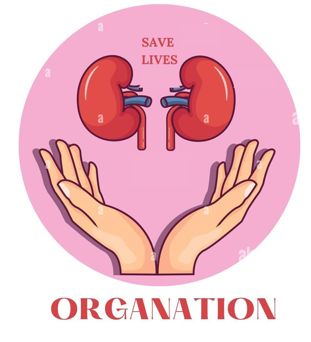

# Project Overview
Organ transplantation in Pakistan faces numerous challenges: lack of awareness, limited access to information, poor communication between stakeholders, long waiting times, medical-record inconsistencies, and legal hurdles that delay or prevent organ transfers. Many patients suffer simply because the right organ is not matched in time, even when willing donors exist. Moreover, manual processes increase the risk of data errors, misinformation, and delays that can cost lives. Organation was developed to solve these problems by offering a secure, transparent, and ethical digital ecosystem that simplifies the transplant journey for all users. It empowers potential donors to register easily, enables patients to find compatible organs quickly, supports medical teams in making informed decisions, and ensures that all legal, ethical, and procedural requirements are met.

Organation goes beyond being just a software system; it is a life-saving platform with real social impact. By digitizing organ donation management, it increases public trust, improves donor, recipient accessibility, reduces delays, and enhances the overall success rate of transplant surgeries. The system promotes awareness, encourages ethical donation practices, and ensures that every donated organ is used efficiently and responsibly. In the long term, Organation aims to expand nationally and globally, connecting people across regions, integrating emerging medical technologies, and building a future where organ shortages are reduced and more lives are saved.

Organation aims to increase public commitment to organ donation by connecting donors and recipients, healthcare professionals, and legal teams. This application caters to multiple user groups, from patients and donors to medical staff and technical teams, providing a secure, efficient, and user-friendly experience.

## Key Users
1. Donors: Individuals willing to donate organs or tissues.
2. Recipients: Patients in need of organ transplants.
3. Administration: Manages accounts and database access.
4. Medical Team: Evaluates medical histories and manages transplant logistics.
5. Policy Management Team: Handles legalities and family consent.
6. Technical Team: Manages app updates and resolves technical issues.
7. Coordination Team: Facilitates communication between donors, recipients, and medical staff.
System Features
### 1. Registration
Separate registrations for donors and recipients, collecting essential medical and social history.
### 2. Search Organs
Recipients can search for available organs based on criteria like blood type, tissue type, and location.
### 3. Organ Matching
Matches donors with recipients using an algorithm based on blood type, medical history, and proximity.
### 4. Organ Allocation
Coordinates organ allocation based on recipient medical urgency and the likelihood of transplant success.
### 5. Wait List Management
Manages a waitlist for organ transplants and prioritizes recipients based on urgency.
### 6. Tracking and Data Management
Tracks donation statistics, transplant success rates, and average wait times, providing insights to improve the process.
### 7. Analytics
Generates reports and analyzes data to enhance the system's efficiency and effectiveness.
### 8. Legal Guidelines
Ensures all legal guidelines are met, including family consent and compliance with ethical standards.
### 9. Technical Support and FAQs
The technical team addresses user issues and maintains the app’s functionality.

The project documentation includes various diagrams to illustrate system architecture and workflows:

### Context Model

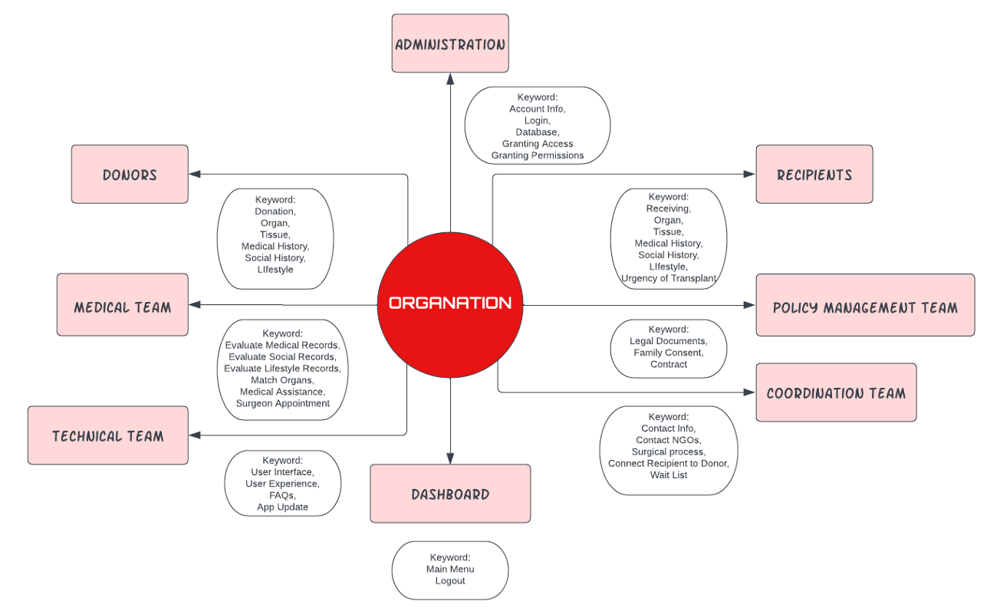

### Process Model

The app "Organisation" is based on an incremental model based on agile development. Our 
application requires rapid changes and continuous patient and doctor communication. Hence, it 
is best if we implement Errors that are easily recognized. It is easier to test and debug. It is more flexible and straightforward to manage risk because it is handled during iteration. The Client gets the necessary functionality early.

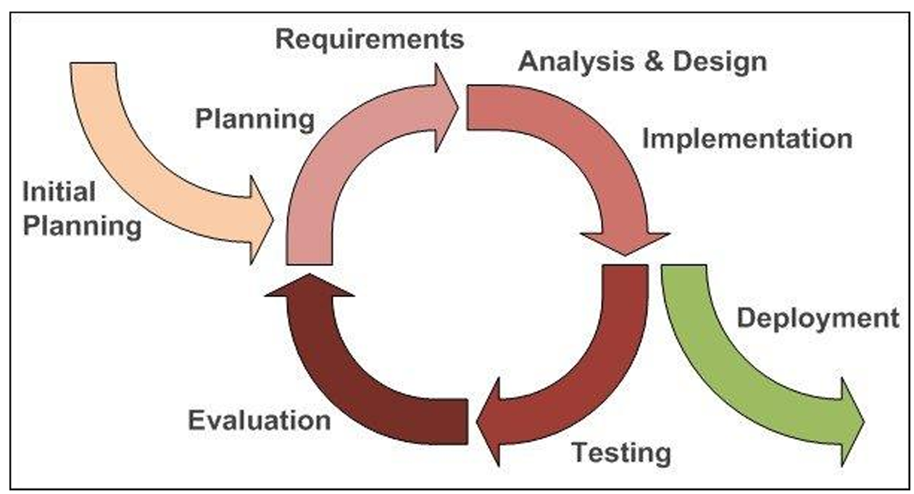

### ERD Diagram
The Entity-Relationship Diagram (ERD) illustrates the complete data structure of the Organation system, showing how core entities such as Donor, Recipient, Organ, Medical Details, Legal Consent, Coordination, and Waitlist are connected. It defines primary keys, relationships, and attributes that ensure accurate organ matching, data security, and traceability throughout the donation and transplant workflow. The ERD serves as the backbone of the database, enabling efficient storage, retrieval, and management of sensitive medical information.

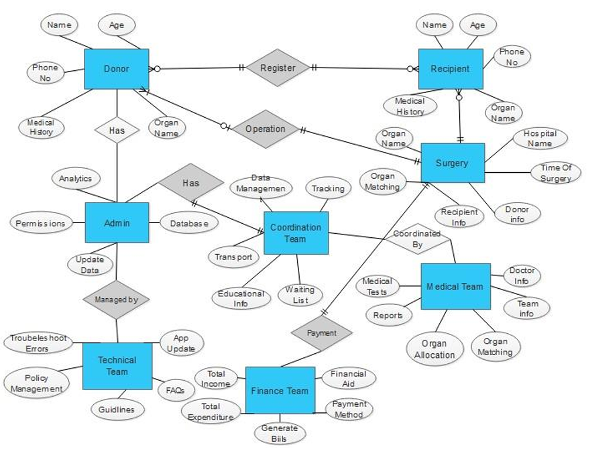

### Use Case Diagrams
The Use Case Diagram represents all major system interactions from the perspective of different user groups, including donors, recipients, medical staff, coordination teams, policy managers, administrators, and technical teams. It outlines core system functionalities such as registration, organ search, matching, allocation, tracking, analytics, legal processing, and technical support. This diagram provides a high-level overview of how each user engages with the system and what outcomes the system delivers for them.

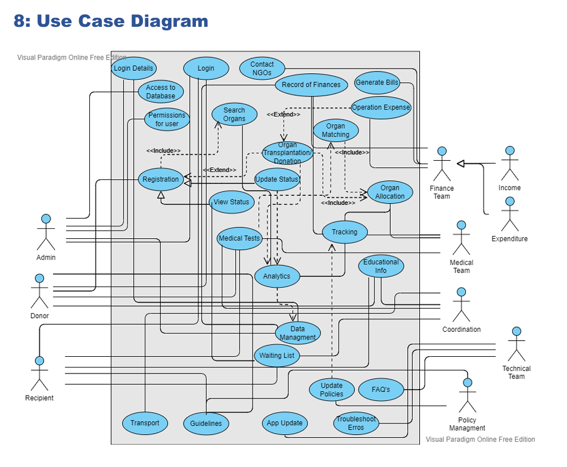

### Sequence Diagrams
This sequence diagram demonstrates the step-by-step workflow for user registration. It shows how a donor or recipient submits their information, how the system validates inputs, interacts with the database, and returns a confirmation. The diagram highlights the chronological communication between the user, interface, and backend services necessary to successfully create a new account.
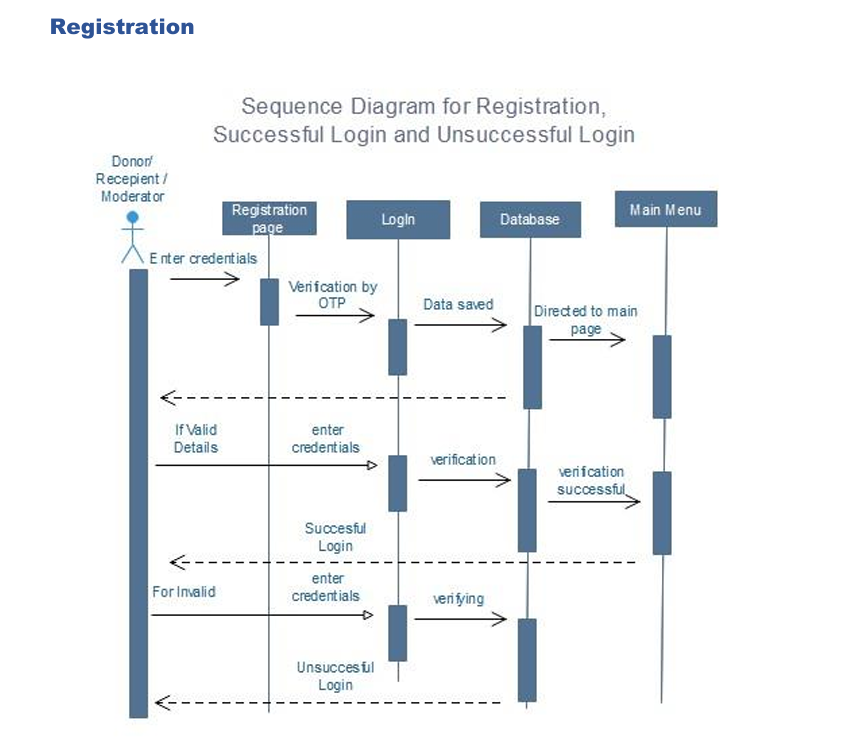
This diagram explains the "Applying as a Recipient" flow. It outlines how the recipient enters organ requirements, how the system checks availability, evaluates medical information, and then adds the recipient to the waitlist if necessary. The sequence clearly shows the logical progression of interactions between the user interface, matching module, and database.
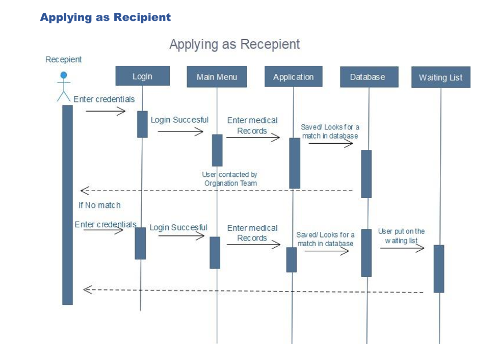
The "Registration as Donor" sequence diagram describes how a donor provides their medical details, selects organs they wish to donate, and submits the form. The system verifies eligibility, saves the information in the database, and notifies the donor of successful registration. It captures the systematic steps required to onboard a donor into the system.

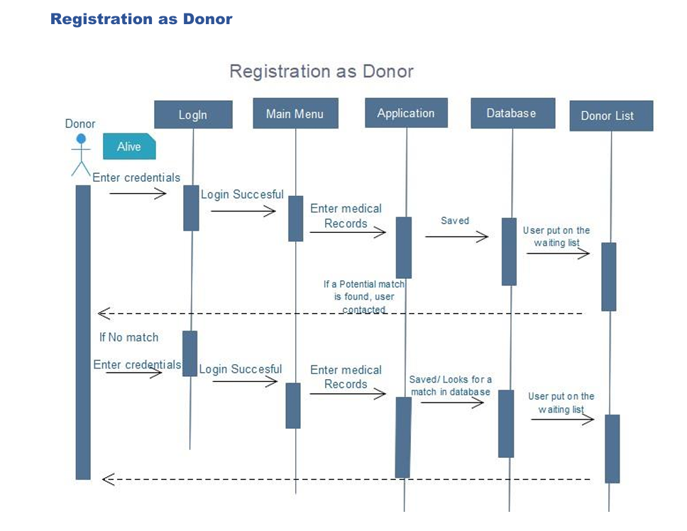
This sequence diagram demonstrates how the Admin accesses and manages the database. It includes authentication, retrieving relevant records, updating or reviewing system logs, and ensuring secure data access. The diagram emphasizes controlled system access and the admin’s role in maintaining data integrity.

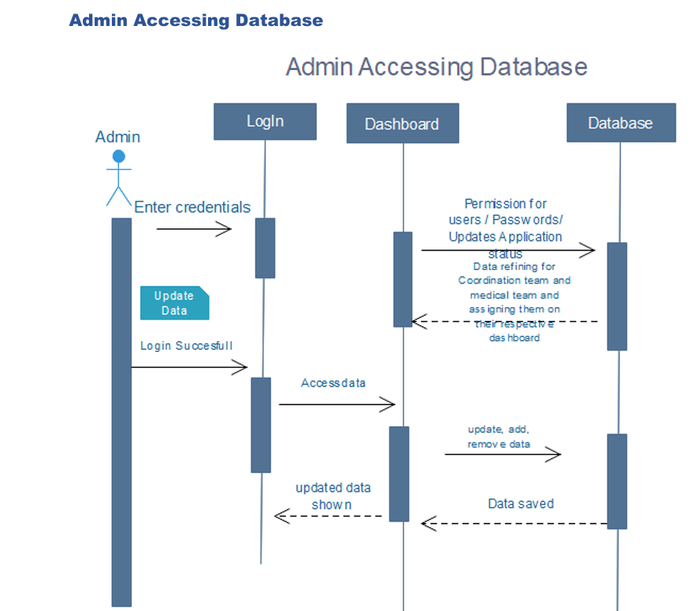
This diagram outlines the workflow of the Coordination Team dashboard. It shows how coordinators view donor/recipient data, monitor the waitlist, manage emergency cases, and facilitate transplant logistics. The sequence highlights how coordination activities depend on real-time data retrieval and updates.

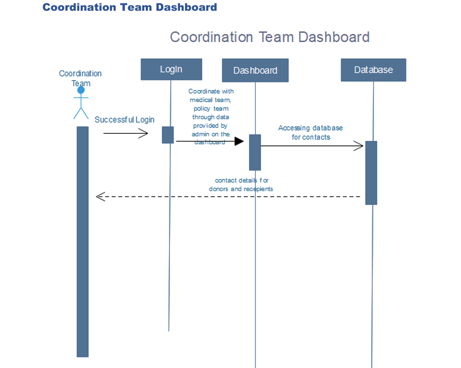
The Technical Team sequence diagram presents how technical members interact with the system to diagnose issues, implement updates, and respond to user technical problems. It shows the process from receiving an issue, checking logs, applying fixes, and updating the system’s functionality.

This diagram illustrates the Medical Team’s workflow, covering how they evaluate patient history, analyze donor-recipient compatibility, record medical findings, and approve or reject transplant procedures. It highlights the system's support for clinical decision-making.
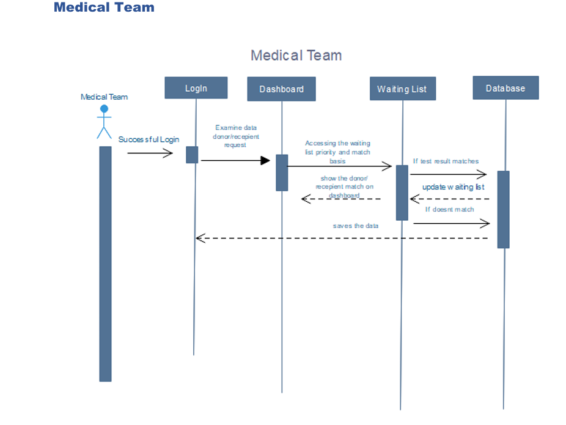
The Finance Team sequence diagram shows how financial support needs are identified, how coordinators connect with NGOs, and how funding approvals are processed. It captures the financial assistance pathway for patients who cannot afford transplant procedures.
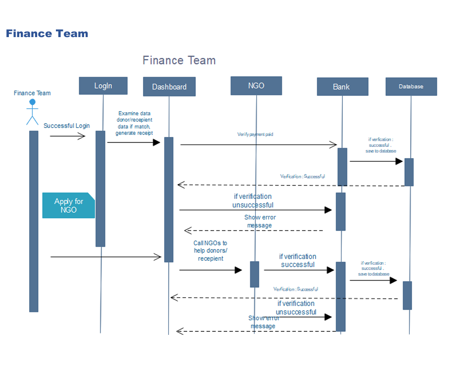

### Data Flow Diagram
The Data Flow Diagram (DFD) maps how information moves through the Organation system from registration to organ search, matching, allocation, tracking, and reporting. It clearly identifies data inputs, outputs, storage points, and processing modules, demonstrating how user information, medical records, and legal documents flow through the system in a structured, secure manner.
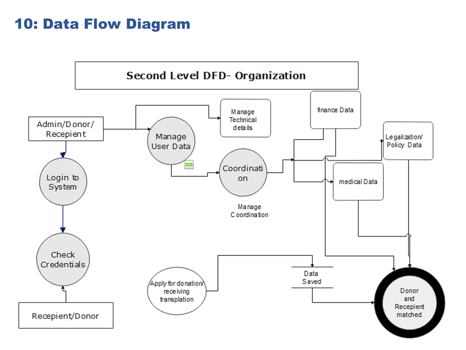
### State Transition Diagram
The State Transition Diagram describes how the system moves through various operational states such as registration, verification, waitlisting, matching, allocation, and post-transplant tracking. It visualizes system behavior in response to events or user actions, ensuring every process follows a controlled and predictable flow.
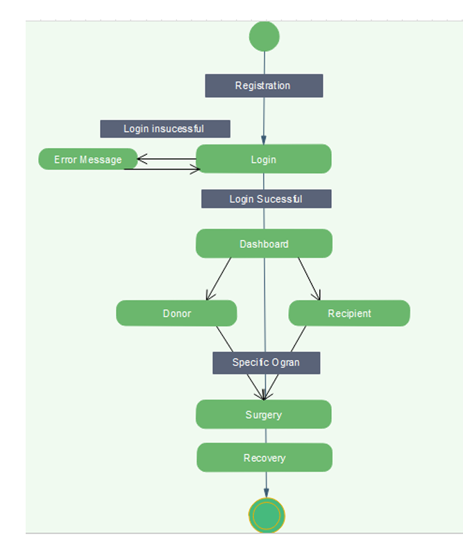
### Activity Diagram
The Activity Diagram illustrates the complete workflow of the organ donation and transplant process, from initial signup to final organ allocation. It shows decision points, parallel activities, conditional paths, and the overall sequence of operations, providing a detailed understanding of how different components work together to complete each task.
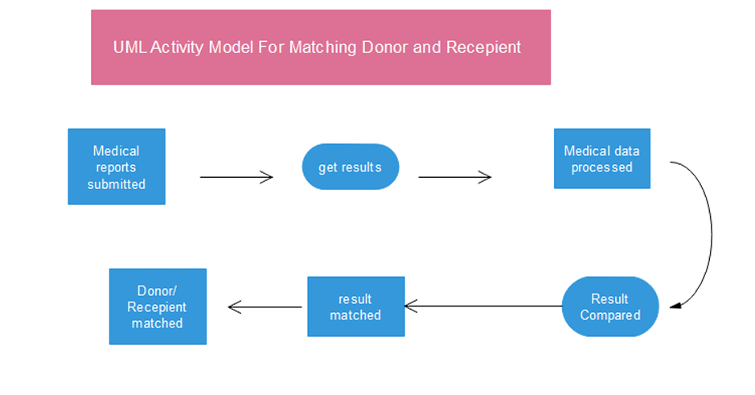
### Class Diagram
The Class Diagram defines the object-oriented structure of the Organation application, including major classes such as User, Donor, Recipient, Organ, MedicalRecord, LegalConsent, and Coordination. It shows their attributes, functions, and relationships, forming the blueprint for the system’s backend architecture and supporting modular, maintainable code.
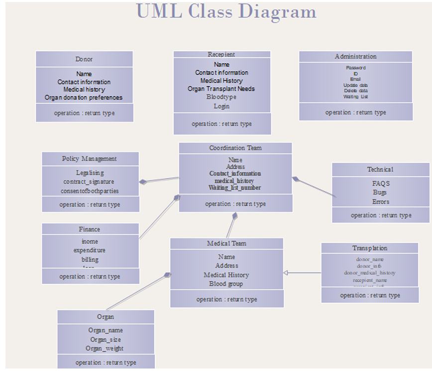

# Future Scope
The future of Organation includes expansion to cover new transplant types, potential global access, integration of emerging medical technologies, and user-friendly interfaces for broader adoption. Goals include increasing global awareness of organ donation, facilitating international connections, and supporting stem cell-based organ regeneration.
Organ transplantation is one of the miracles of modern medicine: it saves lives and improves the 
quality of patients' lives. The future of transplantation is one full of exciting possibilities. Future goals include making the new options more accessible, which include face or hand transplants,protocols permitting the successful minimization or discontinuation of immunosuppressive 
medications, and the use of stem cells for organ regeneration. Other goals of the Organation will be to make the application user-friendly and connect donors and recipients on a larger scale. It will work on encouraging people to donate more and save lives. We can introduce features that will not only focus on one country but the whole world; that way, people from all around the globe can connect. 
There can be a separate server for hospitals.

# Conclusion
Organation offers a secure, efficient, and user-friendly platform to manage the entire organ donation and transplantation process. It enables communication and collaboration between all stakeholders, from donors to medical professionals, creating a valuable resource for the healthcare community.

## My Contribution 

Designed the complete Organation system architecture, mapping all donor, recipient, medical, legal, and coordination workflows into a unified platform.

